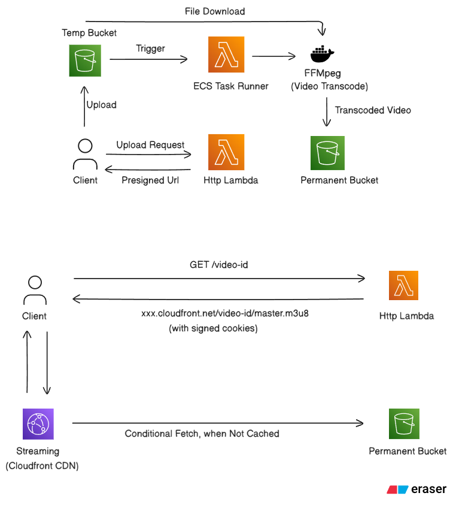

# 🎬 Video Streaming Platform

A production-grade, cloud-native video streaming platform built on AWS, featuring adaptive bitrate (ABR) HLS streaming, event-driven transcoding, and a modern React frontend. Videos are uploaded directly from the browser to S3, automatically transcoded into multi-resolution HLS segments by a Fargate container, and served securely through CloudFront with time-limited signed cookies.

---

## Table of Contents

- [Architecture Overview](#architecture-overview)
- [How It Works — End-to-End Flow](#how-it-works--end-to-end-flow)
- [Project Structure](#project-structure)
- [Components](#components)
  - [Frontend (React + Vite)](#frontend-react--vite)
  - [HTTP Lambda (API Backend)](#http-lambda-api-backend)
  - [Video Transcoding Lambda (S3 Event Trigger)](#video-transcoding-lambda-s3-event-trigger)
  - [Video Transcoding Worker (ECS Fargate Container)](#video-transcoding-worker-ecs-fargate-container)
- [Tech Stack](#tech-stack)
- [Prerequisites](#prerequisites)
- [AWS Infrastructure Setup](#aws-infrastructure-setup)
- [Environment Variables](#environment-variables)
- [Local Development](#local-development)
- [Deployment](#deployment)
- [Development Journal — Bugs & Discoveries](#development-journal--bugs--discoveries)
- [API Reference](#api-reference)
- [HLS Transcoding Details](#hls-transcoding-details)
- [IAM & Security Model](#iam--security-model)
- [Key Design Decisions](#key-design-decisions)

---

## Architecture Overview



---

## How It Works — End-to-End Flow

### Upload Flow

1. **User selects a video** (`.mp4` or `.mkv`) in the frontend.
2. The browser reads the file's duration locally (without uploading) via a hidden `<video>` element.
3. The frontend calls `POST /` on the HTTP Lambda with file metadata (`fileName`, `fileType`, `fileSize`, `duration`).
4. The Lambda creates a new **MongoDB document** for the video and returns an **S3 pre-signed URL** (valid 30 seconds).
5. The frontend **directly uploads** the raw file to S3 using the pre-signed URL with real-time progress tracking via `XMLHttpRequest`.

### Transcoding Flow (Event-Driven)

6. S3 fires an `ObjectCreated` event to the **Video Transcoding Lambda**.
7. The Lambda validates the file (non-zero size, `.mp4`/`.mkv` extension) and calls `ecs:RunTask` on Fargate, passing job context (`JOB_ID`, `INPUT_BUCKET`, `INPUT_KEY`, `OUTPUT_BUCKET`) as container environment variables.
8. The **ECS Fargate container** (Docker image with Node.js + FFmpeg):
   - Downloads the raw video from the temp S3 bucket.
   - Runs FFmpeg to produce a **3-rung HLS ABR ladder** (360p, 480p, 720p).
   - Uploads all segments and playlists (`master.m3u8`, variant `index.m3u8`s, and `.ts` segments) to the permanent S3 output bucket under a prefix matching the video's UUID.
   - Deletes the original raw file from the temp bucket.

### Playback Flow

9. User clicks **Play** on a video in the list.
10. The frontend calls `GET /:id` on the HTTP Lambda.
11. The Lambda generates **CloudFront signed cookies** (valid 1 hour) scoped to `/<videoId>/*` using RSA private key + CloudFront key pair.
12. The Lambda sets three `Set-Cookie` response headers (`CloudFront-Policy`, `CloudFront-Signature`, `CloudFront-Key-Pair-Id`) and returns the `master.m3u8` URL.
13. The **Media Chrome** player (using `hls-video-element`) fetches HLS segments from CloudFront — the signed cookies are automatically attached by the browser, authorizing every segment request.

---

## Project Structure

```
Video-Streaming/
├── frontend/                  # React + Vite SPA (Media Chrome player)
│   ├── src/
│   │   ├── components/
│   │   │   ├── Layout.tsx         # Navigation shell
│   │   │   ├── VideoList.tsx      # Browse and play uploaded videos
│   │   │   ├── UploadView.tsx     # Drag-and-drop upload UI with progress
│   │   │   ├── Player.tsx         # Media Chrome HLS player
│   │   │   └── PlayUrlView.tsx    # Play any HLS URL directly
│   │   ├── App.tsx                # View router and stream session state
│   │   ├── api.ts                 # Typed fetch wrappers for the backend
│   │   ├── types.ts               # Shared TypeScript types
│   │   └── index.css              # Design system tokens + global styles
│   ├── vite.config.ts             # Vite + path aliases + CDN proxy
│   └── package.json
│
├── httpLambda/                # Express API served via Lambda Function URL
│   ├── src/
│   │   ├── controllers/
│   │   │   ├── listVideos.controllers.ts   # GET / → return all videos
│   │   │   ├── uploadVideo.controllers.ts  # POST / → presigned URL + DB record
│   │   │   └── streamVideo.controllers.ts  # GET /:id → CloudFront signed cookies
│   │   └── models/
│   │       └── video.models.ts    # Mongoose schema (videoId, videoName, size, duration)
│   ├── app.ts                     # Express app + Lambda export
│   ├── db.ts                      # Mongoose connection
│   ├── serverless.ts              # Serverless Framework v4 configuration
│   └── package.json
│
├── videoTranscodingLambda/    # S3-triggered Lambda that launches ECS tasks
│   ├── app.ts                     # S3Event handler → ecs:RunTask
│   ├── serverless.ts              # Serverless Framework v4 configuration
│   └── package.json
│
├── videoTranscodingWorker/    # Docker container run by ECS Fargate
│   ├── src/
│   │   ├── transcodeVideo.ts      # FFmpeg 3-rung HLS ABR transcoding
│   │   └── s3.ts                  # S3 download / upload-directory / delete helpers
│   ├── app.ts                     # Container entrypoint (orchestrates the pipeline)
│   ├── Dockerfile                 # Multi-stage build (Node 22 + FFmpeg)
│   └── package.json
│
├── note.md                    # Learning notes: HLS theory, FFmpeg commands
├── executing-ecs-task-with-lambda.md  # Deep-dive: Lambda→ECS orchestration pattern
└── dev-logs.yaml              # Development log
```

---

## Components

### Frontend (React + Vite)

A single-page application built with React 19, TypeScript, and Vite. Uses **Media Chrome** (Web Components) and **hls-video-element** for HLS playback — no Video.js dependency.

**Key features:**
- **Video list view** — fetches all uploaded videos with name, duration, and size
- **Upload view** — drag-and-drop or file picker; reads video duration client-side; shows real-time upload progress percentage via XHR
- **HLS Player view** — Media Chrome control bar with play, mute, volume, seek, time display, playback rate, **quality rendition selector** (360p / 480p / 720p), PiP, and fullscreen
- **Play URL view** — paste any HLS URL to play directly (useful for testing)
- **Signed-stream loading overlay** — shows spinner while the backend sets cookies
- **Dark glassmorphism design** — purple accent, CSS custom properties design system

The Vite config proxies `/cdn/*` requests to the CloudFront domain in development, enabling signed-cookie playback without CORS issues on localhost.

**Technology:** React 19, TypeScript 6, Vite 8, Media Chrome 4, hls-video-element 1.5, pnpm

---

### HTTP Lambda (API Backend)

An Express 5 app wrapped with `serverless-http` and deployed as an AWS Lambda Function URL. Connects to MongoDB (via Mongoose) at cold start.

**Routes:**

| Method | Path   | Handler              | Description                                                    |
|--------|--------|----------------------|----------------------------------------------------------------|
| GET    | `/`    | `listVideos`         | Returns all video documents from MongoDB                       |
| POST   | `/`    | `uploadVideo`        | Validates file metadata, creates DB record, returns S3 pre-signed PUT URL (30s TTL) |
| GET    | `/:id` | `streamVideo`        | Looks up video by ID, generates CloudFront signed cookies (1h TTL), returns `master.m3u8` URL |

**CloudFront cookie signing:**
- Reads RSA private key from `CLOUDFRONT_PRIVATE_KEY_BASE64` env var (base64-encoded PEM)
- Uses `@aws-sdk/cloudfront-signer` to create a `Policy`-type signed cookie scoped to `https://<domain>/<videoId>/*`
- Sets `CloudFront-Policy`, `CloudFront-Signature`, and `CloudFront-Key-Pair-Id` cookies with `HttpOnly; SameSite=Lax`

**Technology:** Node.js 24, Express 5, Mongoose 9, AWS SDK v3, Serverless Framework v4

---

### Video Transcoding Lambda (S3 Event Trigger)

A lightweight Lambda function that acts as an **event-driven dispatcher** — it never touches the video data itself.

**Trigger:** `s3:ObjectCreated:*` on the temp S3 bucket

**Logic:**
1. Decodes the S3 object key from the event
2. Skips empty files (folders) and unsupported extensions
3. Calls `ecs:RunTask` on the Fargate cluster, passing job context as container environment variable overrides:
   - `JOB_ID` — a fresh `crypto.randomUUID()`
   - `INPUT_BUCKET` — source bucket name
   - `INPUT_KEY` — object key of the raw video
   - `OUTPUT_BUCKET` — destination bucket for HLS output
4. Checks `response.failures` and throws if ECS rejected the request

**Technology:** Node.js 24, AWS SDK v3 (ECS client), Serverless Framework v4

---

### Video Transcoding Worker (ECS Fargate Container)

A Node.js process run as a **one-shot ECS task**. It exists only for the duration of one transcoding job, then exits.

**Pipeline:**
1. Validates required environment variables (`JOB_ID`, `INPUT_BUCKET`, `INPUT_KEY`, `OUTPUT_BUCKET`)
2. Derives a unique output directory from the input key's basename (without extension)
3. Downloads the raw video from S3 to `/tmp`, streaming body directly to disk via Node.js pipeline
4. Runs FFmpeg to produce a **3-rung adaptive bitrate HLS ladder**:

   | Rendition | Resolution | Video Bitrate | Max Rate | Audio Bitrate |
   |-----------|-----------|---------------|----------|---------------|
   | 360p      | 640×360   | 800 kbps      | 1000 kbps | 96 kbps       |
   | 480p      | 854×480   | 1400 kbps     | 1800 kbps | 128 kbps      |
   | 720p      | 1280×720  | 2800 kbps     | 3500 kbps | 128 kbps      |

5. Each segment is 6 seconds; codec is H.264 (`libx264`) + AAC at 48 kHz; GOP size = 48 frames; output type = `vod`
6. Uploads all output files to the permanent S3 bucket under `/<videoId>/` prefix:
   - `<videoId>/master.m3u8`
   - `<videoId>/360p/index.m3u8` + `<videoId>/360p/segment000.ts`, `001.ts`, …
   - `<videoId>/480p/index.m3u8` + segments
   - `<videoId>/720p/index.m3u8` + segments
7. Deletes the raw video from the temp bucket and removes the local temp file
8. Exits (`process.exit(1)` on any error)

**Dockerfile:** Multi-stage build — compiles TypeScript in a builder stage, installs FFmpeg via `apt-get` in the runtime stage, copies only the compiled `dist/` and production `node_modules`.

**Technology:** Node.js 22, TypeScript 6, AWS SDK v3 (S3 client), FFmpeg (system package), Docker, pnpm

---

## Tech Stack

| Layer | Technology |
|---|---|
| Frontend | React 19, TypeScript, Vite 8, Media Chrome, hls-video-element |
| API Backend | Node.js 24, Express 5, Mongoose 9, Serverless Framework v4 |
| Database | MongoDB (via Mongoose) |
| S3 Trigger | AWS Lambda (Node.js 24), AWS SDK v3 ECS client |
| Transcoding | AWS ECS Fargate, FFmpeg, Node.js 22, Docker |
| CDN | AWS CloudFront (signed cookies, RSA key pair) |
| Storage | AWS S3 (two buckets: temp + permanent) |
| Infrastructure | Serverless Framework v4, AWS IAM |
| Package Managers | pnpm (frontend, worker), npm (Lambda functions) |

---

## Prerequisites

- **Node.js** ≥ 22
- **pnpm** (for frontend and worker)
- **npm** (for Lambda functions)
- **Docker** (to build and push the worker image)
- **AWS CLI** configured with appropriate IAM permissions
- **Serverless Framework v4** (`npm i -g serverless`)
- **MongoDB** instance (Atlas or self-hosted) — connection string in env
- **FFmpeg** — only needed inside Docker; not required on the host

---

## AWS Infrastructure Setup

The following AWS resources must be created before deploying:

### S3 Buckets
- **Temp bucket** (`temp-bucket-raquib`) — raw video uploads land here; Lambda is triggered by `s3:ObjectCreated:*`
- **Output bucket** (`raquib-permanent-bucket`) — stores final HLS segments; served via CloudFront

### CloudFront Distribution
- Origin: the **output S3 bucket**
- Viewer access: **Trusted key groups** (RSA key pair for signed cookies)
- Cache behavior: forward cookies (`CloudFront-Policy`, `CloudFront-Signature`, `CloudFront-Key-Pair-Id`)
- Note the **Key Pair ID** and **Distribution Domain** for env vars

### ECS Cluster & Task Definition
- **Cluster:** `video-transcoding-cluster` (Fargate)
- **Task definition:** `video-transcoder` pointing to your ECR image
  - CPU: ≥ 1024 (1 vCPU), Memory: ≥ 2048 MB
  - **Task role** — needs `s3:GetObject`, `s3:PutObject`, `s3:DeleteObject` on both buckets
  - **Task execution role** — needs ECR pull, CloudWatch logs
- VPC subnets and security group (egress to S3, ECR, internet)

### IAM Roles
- **HTTP Lambda role** — `s3:PutObject` (temp bucket for presigned URL), `cloudfront:*` not needed (signing is done locally with private key)
- **Transcoding Lambda role** — `ecs:RunTask` + `iam:PassRole` (for both task execution and task roles)
- **ECS Task role** — `s3:GetObject` on temp bucket, `s3:PutObject` on output bucket, `s3:DeleteObject` on temp bucket

### ECR Repository
Push the `videoTranscodingWorker` Docker image:
```bash
aws ecr create-repository --repository-name video-transcoder
docker build -t video-transcoder ./videoTranscodingWorker
docker tag video-transcoder:latest <account-id>.dkr.ecr.ap-south-1.amazonaws.com/video-transcoder:latest
aws ecr get-login-password | docker login --username AWS --password-stdin <account-id>.dkr.ecr.ap-south-1.amazonaws.com
docker push <account-id>.dkr.ecr.ap-south-1.amazonaws.com/video-transcoder:latest
```

---

## Environment Variables

### `httpLambda/` (set in `serverless.ts` → `environment` + Lambda secrets)

| Variable | Description |
|---|---|
| `BUCKET_NAME` | Name of the S3 temp bucket for pre-signed uploads |
| `CLOUDFRONT_KEY_PAIR_ID` | CloudFront RSA key pair ID (starts with `K...`) |
| `CLOUDFRONT_DOMAIN` | CloudFront distribution domain (e.g. `d2tqc45o39v2m3.cloudfront.net`) |
| `CLOUDFRONT_PRIVATE_KEY_BASE64` | Base64-encoded RSA private key PEM — **set this as a Lambda secret/env var, not in `serverless.ts`** |
| `MONGODB_URI` | MongoDB connection string — **set as a Lambda secret** |

To base64-encode your private key:
```bash
base64 -w 0 private_key.pem
```

### `videoTranscodingLambda/` (set in `serverless.ts` → `environment`)

| Variable | Description |
|---|---|
| `CLUSTER_ARN` | ARN of the ECS cluster |
| `TASK_DEFINITION_ARN` | ARN (with version) of the ECS task definition |
| `SUBNET_IDS` | Comma-separated list of VPC subnet IDs for the Fargate task |
| `SECURITY_GROUP_ID` | Security group ID for the Fargate task |
| `OUTPUT_BUCKET` | Name of the S3 output bucket |

### `videoTranscodingWorker/` (injected by ECS at runtime via container overrides)

| Variable | Description |
|---|---|
| `JOB_ID` | Unique UUID for this transcoding job (generated by the dispatcher Lambda) |
| `INPUT_BUCKET` | Source S3 bucket name |
| `INPUT_KEY` | S3 object key of the raw video file |
| `OUTPUT_BUCKET` | Destination S3 bucket for HLS output |

### `frontend/` (`.env.local`)

| Variable | Description |
|---|---|
| `VITE_API_BASE_URL` | Lambda Function URL (e.g. `https://xxxx.lambda-url.ap-south-1.on.aws`) |

---

## Local Development

### Frontend

```bash
cd frontend
pnpm install
pnpm dev          # starts at http://localhost:5173
```

The Vite dev server proxies `/cdn/*` → `https://d2tqc45o39v2m3.cloudfront.net` (configured in `vite.config.ts`). Update this if your CloudFront domain changes.

Set `VITE_API_BASE_URL` in `frontend/.env.local`:
```
VITE_API_BASE_URL=http://localhost:8080
```

### HTTP Lambda (local Express server)

```bash
cd httpLambda
npm install
npm run build         # tsc → dist/
node dist/app.js      # listens on :8080 when AWS_EXECUTION_ENV is not set
```

Requires `MONGODB_URI`, `BUCKET_NAME`, `CLOUDFRONT_KEY_PAIR_ID`, `CLOUDFRONT_DOMAIN`, and `CLOUDFRONT_PRIVATE_KEY_BASE64` set in your shell environment.

### Video Transcoding Worker (local test)

```bash
cd videoTranscodingWorker
pnpm install
pnpm build

JOB_ID=test-job-1 \
INPUT_BUCKET=temp-bucket-raquib \
INPUT_KEY=some-video.mp4 \
OUTPUT_BUCKET=raquib-permanent-bucket \
node dist/app.js
```

Requires AWS credentials in the environment and FFmpeg installed locally.

---

## Deployment

### 1. Build and push the Fargate worker image

```bash
cd videoTranscodingWorker
pnpm build
docker build -t video-transcoder .
# tag and push to ECR (see Infrastructure Setup above)
```

Update the ECS task definition to point to the new image revision.

### 2. Deploy the Transcoding Lambda

```bash
cd videoTranscodingLambda
npm install
npm run build         # tsc → dist/
npx serverless deploy --stage prod
```

### 3. Deploy the HTTP Lambda

```bash
cd httpLambda
npm install
npm run build         # tsc → dist/
npx serverless deploy --stage prod
```

After deployment, copy the **Function URL** from the output and set it as `VITE_API_BASE_URL` in the frontend `.env.local` or your hosting environment.

### 4. Build and deploy the Frontend

```bash
cd frontend
pnpm install
pnpm build            # outputs to frontend/dist/
```

Deploy `frontend/dist/` to any static host (S3 + CloudFront, Vercel, Netlify, etc.).

---

## API Reference

All endpoints are on the HTTP Lambda Function URL.

### `GET /`

Lists all uploaded videos.

**Response `200 OK`:**
```json
[
  {
    "_id": "6868a3f2c1234567890abcde",
    "videoId": "550e8400-e29b-41d4-a716-446655440000",
    "videoName": "demo.mp4",
    "originalSize": 104857600,
    "duration": 142
  }
]
```

---

### `POST /`

Registers a video upload and returns a pre-signed S3 URL.

**Request body:**
```json
{
  "fileName": "demo.mp4",
  "fileType": "video/mp4",
  "fileSize": 104857600,
  "duration": 142
}
```

Supported formats: `.mp4`, `.mkv`. Maximum size: 2 GB.

**Response `200 OK`:**
```json
{
  "message": "Video uploaded successfully!",
  "signedUrl": "https://temp-bucket-raquib.s3.ap-south-1.amazonaws.com/..."
}
```

The client must then `PUT` the file binary directly to `signedUrl` with the correct `Content-Type` header within **30 seconds**.

---

### `GET /:id`

Issues CloudFront signed cookies and returns the HLS master playlist URL.

**Response `200 OK`** (with `Set-Cookie` headers):
```json
{
  "success": true,
  "videoUrl": "https://d2tqc45o39v2m3.cloudfront.net/550e8400.../master.m3u8"
}
```

**Set-Cookie headers:**
```
CloudFront-Policy=<base64>; Domain=d2tqc45o39v2m3.cloudfront.net; Path=/; HttpOnly; SameSite=Lax
CloudFront-Signature=<rsa-sig>; ...
CloudFront-Key-Pair-Id=KUYLHDJWPQMEO; ...
```

Cookies are valid for **1 hour** and scoped to `/<videoId>/*` — each video session gets independently gated access.

---

## HLS Transcoding Details

The worker uses a single FFmpeg command to produce all three renditions simultaneously via stream mapping:

```bash
ffmpeg -i input.mp4 \
  # Map video+audio for each of the 3 renditions
  -map 0:v:0 -map 0:a:0 \
  -map 0:v:0 -map 0:a:0 \
  -map 0:v:0 -map 0:a:0 \
  # Codec: H.264 + AAC @ 48kHz
  -c:v libx264 -c:a aac -ar 48000 \
  # 360p rendition
  -filter:v:0 scale=w=640:h=360  -b:v:0 800k  -maxrate:v:0 1000k -bufsize:v:0 1600k \
  # 480p rendition
  -filter:v:1 scale=w=854:h=480  -b:v:1 1400k -maxrate:v:1 1800k -bufsize:v:1 2800k \
  # 720p rendition
  -filter:v:2 scale=w=1280:h=720 -b:v:2 2800k -maxrate:v:2 3500k -bufsize:v:2 5600k \
  # Audio bitrates
  -b:a:0 96k -b:a:1 128k -b:a:2 128k \
  # H.264 / HLS tuning
  -preset medium -g 48 -keyint_min 48 -sc_threshold 0 \
  # HLS output
  -f hls -hls_time 6 -hls_playlist_type vod \
  -hls_flags independent_segments \
  -master_pl_name master.m3u8 \
  -var_stream_map "v:0,a:0,name:360p v:1,a:1,name:480p v:2,a:2,name:720p" \
  -hls_segment_filename "output/%v/segment%03d.ts" \
  "output/%v/index.m3u8"
```

**Output layout in S3:**
```
<videoId>/
  master.m3u8          ← master playlist (referenced by the player)
  360p/
    index.m3u8         ← variant playlist
    segment000.ts
    segment001.ts
    ...
  480p/
    index.m3u8
    segment000.ts
    ...
  720p/
    index.m3u8
    segment000.ts
    ...
```

---

## IAM & Security Model

Three distinct IAM identities are involved in the transcoding pipeline:

```
Lambda Execution Role (httpLambda)
  └─ s3:PutObject on temp-bucket (to generate presigned PUT URLs)

Lambda Execution Role (transcodingLambda)
  ├─ ecs:RunTask on video-transcoder task definition
  └─ iam:PassRole on:
       - ECS Task Execution Role
       - ECS Task Role

ECS Task Execution Role
  └─ ecr:GetAuthorizationToken, ecr:BatchGetImage (pull image)
  └─ logs:CreateLogStream, logs:PutLogEvents (CloudWatch)

ECS Task Role (used by the worker container at runtime)
  ├─ s3:GetObject on temp-bucket (download raw video)
  ├─ s3:PutObject on output-bucket (upload HLS segments)
  └─ s3:DeleteObject on temp-bucket (clean up raw video)
```

**CloudFront access control:** HLS content in the output bucket is **not publicly accessible**. Every CloudFront request requires the three signed cookies set by the HTTP Lambda. Cookies are time-limited (1 hour) and path-scoped per video, so a cookie for video A cannot access video B's segments.

---

## Key Design Decisions

### Why Lambda → ECS instead of Lambda-only transcoding?
Lambda has a 15-minute runtime limit and limited CPU/memory, making it unsuitable for transcoding large videos. ECS Fargate tasks can run for hours with configurable vCPUs and memory. Lambda acts as a lightweight, zero-cost event dispatcher; ECS provides the heavy lifting.

### Why direct S3 upload (pre-signed URL) instead of through the API?
Routing large binary files through a Lambda function is expensive (data transfer costs) and slow. Pre-signed URLs let the browser upload directly to S3 with no API intermediary, and the Lambda's 6MB payload limit is avoided entirely.

### Why CloudFront signed cookies instead of signed URLs?
HLS playback involves dozens of individual HTTP requests (one per segment). Signed URLs would require signing each segment URL individually. Signed cookies are set once per session and automatically attached to every subsequent request to the CloudFront distribution.

### Why Media Chrome instead of Video.js?
Media Chrome uses standard Web Components (`<media-controller>`, `<hls-video-element>`) that integrate naturally with React without needing a plugin ecosystem. The `hls-video-element` custom element exposes HLS rendition information natively, enabling the `<media-rendition-selectmenu>` quality selector without extra plugins.

### Why two S3 buckets?
The temp bucket stores raw, unprocessed uploads. After transcoding, the original is deleted, keeping the temp bucket lean. The output bucket holds only finalized HLS content and is served through CloudFront. This separation also allows different IAM policies and lifecycle rules per bucket.

---

## Development Journal — Bugs & Discoveries

This section documents real bugs encountered while building the project and how they were resolved. It is derived directly from `dev-logs.yaml`.

---

### 🐛 Bugs & Fixes

#### 1. Stream pipeline completion — `readStream` vs `writeStream` finish
**Issue:** It was unclear whether `readStream` finishing guarantees that `writeStream` has also drained and flushed its data to disk.  
**Fix:** Node.js's `pipeline()` (from `node:stream/promises`) handles this implicitly — it resolves only when the destination writable has finished and all data has been flushed. No manual event wiring needed.

---

#### 2. Path alias (`@/*`) works in the IDE but not at build time
**Issue:** TypeScript path aliases like `@/components/Foo` work with IntelliSense in VS Code but `tsc` does not rewrite them to actual relative imports. This causes build failures.  
**Fix:** Switched to relative imports. Using `vite-tsconfig-paths` solves this for the Vite dev/build pipeline, but `tsc` alone can't resolve aliases. Relative imports are simpler and have no runtime overhead.

---

#### 3. ECS task launch from Lambda — `iam:PassRole` requirement
**Issue:** Granting only `ecs:RunTask` to the Lambda execution role was not enough to start ECS tasks that reference explicit IAM roles (task execution role + task role).  
**Fix:** Two IAM permissions are required:
- `ecs:RunTask` — on the ECS task definition resource
- `iam:PassRole` — on both the ECS task execution role and the task role ARNs

`iam:PassRole` is AWS's delegation mechanism: it authorizes the Lambda to hand those roles to ECS on its behalf.

---

#### 4. S3 trigger type — `PUT` only vs all object creation events
**Issue:** The Lambda was originally configured to trigger only on `s3:ObjectCreated:Put`. Uploading via the AWS console or AWS CLI uses different event subtypes (e.g. `s3:ObjectCreated:CompleteMultipartUpload`), so those uploads were silently ignored.  
**Fix:** Always configure the S3 trigger on **`s3:ObjectCreated:*`** to catch all creation events regardless of upload method.

---

#### 5. pnpm `node_modules` zipping breaks Lambda deployment
**Issue:** Zipping a pnpm-managed `node_modules` directory caused failures in the Lambda runtime. pnpm uses symlinks for packages (to a content-addressable store), and the zip tool was either not preserving symlinks or the Lambda runtime didn't handle them.  
**Fix:**
- Tried adding `node-linker=hoisted` in `.npmrc` to force a flat, npm-like structure — symlinks were still being created.
- Migrated the Lambda packages to **npm**, which produces a fully flat `node_modules`.
- Interesting observation: the pnpm zip was ~26 MB vs ~3 MB with npm — symlinks inflate apparent size significantly depending on how the zip tool follows them.

---

#### 6. ECS container: `dist/app.js not found` in production but works locally
**Issue:** The Docker container ran correctly locally but on ECS it reported `Module dist/app.js not found`.  
**Fix:** Two compounding issues:
1. The ECS task definition was still pointing to an **older image revision** in ECR.
2. The local image tag (`latest`) had been rebuilt but the ECR push step had not been re-run, so ECR still served the stale image.

**Resolution process:** Build and push the new image → create a **new task definition revision** pointing to the new image → update the `TASK_DEFINITION_ARN` env var in the dispatcher Lambda → update the `ecs:RunTask` IAM policy to reference the new revision.

---

#### 7. Video directory naming — UUID vs MongoDB ObjectId
**Issue:** Pre-existing transcoded video directories in S3 were named by UUID, not MongoDB ObjectId. Switching to ObjectId would break backward compatibility.  
**Fix:** Continued using UUID for all video identifiers going forward for consistency and backward compatibility.

---

#### 8. Worker needs to know the output S3 prefix before transcoding finishes
**Issue:** The ideal S3 key prefix for HLS output would be a MongoDB-generated `_id`. But the DB record is created before transcoding, and the worker runs asynchronously — there's no easy handshake.  
**Fix:** Generate a **UUID at upload time** (in the HTTP Lambda), use it as both the S3 object key (in the temp bucket) and the `videoId` field in MongoDB. The dispatcher Lambda passes `INPUT_KEY` to the worker; the worker derives the output prefix from the key's basename. This way, the prefix is determined before upload and consistent across DB, temp bucket, and output bucket.

---

#### 9. CloudFront signed cookies — same-domain constraint
**Issue:** Browser cookie rules prevent a server at `api.example.com` from setting cookies scoped to `cdn.cloudfront.net`. Attempting to set `Domain=d2tqc45o39v2m3.cloudfront.net` from the Lambda origin causes the browser to reject the cookie as a cross-site cookie.  
**Fix:** In production, a **custom domain** is required where both the API and the CloudFront distribution share the same parent domain (e.g. `api.myapp.com` and `cdn.myapp.com` → `Domain=.myapp.com`). For local testing, the CloudFront distribution was temporarily made public. This is a known architectural requirement for signed-cookie setups.

---

#### 10. CloudFront private key corrupted by Lambda environment variable encoding
**Issue:** Storing the RSA private key PEM directly in a Lambda environment variable corrupted the newline characters — the `\n` sequences were stored as literal backslash + `n`, causing the OpenSSL decoder to fail with: `error:1E08010C:DECODER routines::unsupported`.  
**Fix:** **Base64-encode** the PEM file before storing it as an env var, then decode it at runtime:
```bash
# Encode before storing
base64 -w 0 private_key.pem
```
```ts
// Decode at runtime
const privateKey = atob(process.env["CLOUDFRONT_PRIVATE_KEY_BASE64"]!);
```

---

#### 11. `s3:ListBucket` required even for `GetObject` operations
**Issue:** A `GetObjectCommand` request failed even though the task role had `s3:GetObject`. The AWS SDK was internally making a list-bucket call (likely for SDK-level path resolution).  
**Fix:** Added `s3:ListBucket` to the task role. The GetObject operation then succeeded.

---

#### 12. Pre-signed URL can be reused until it expires
**Issue:** An S3 pre-signed `PUT` URL has no built-in single-use enforcement — a client could use the same URL multiple times within its validity window.  
**Fix:** Set a very short TTL (30 seconds) so the URL expires before a second upload attempt is practical. The expiry timer starts before the upload begins, so a slow upload may technically see an expired URL — but this is acceptable since the expiry prevents abuse more effectively than it causes usability issues.

---

### 💡 Useful Discoveries

| Discovery | Detail |
|---|---|
| `path.relative(base, absolute)` | Strips the `base` prefix from an absolute path, giving you a path relative to that base — e.g. `path.relative("/tmp/uuid", "/tmp/uuid/720p/index.m3u8")` → `"720p/index.m3u8"`. Used to compute correct S3 keys when uploading the output directory. |
| Recursive S3 directory upload | S3 has no concept of directories. To upload a directory, you must walk it recursively and call `PutObjectCommand` for every file individually, composing the S3 key from the file's relative path. |
| Callback → Promise pattern | Wrap callback-based APIs (like `child_process.spawn`) in a single `Promise` constructor so the rest of the code can use `async/await`. Keep the promise boundary thin and the surrounding code flat. |
| ECS container credentials | When an ECS task runs with a task role, AWS injects `AWS_CONTAINER_CREDENTIALS_RELATIVE_URI` into the container environment. The AWS SDK reads this env var to fetch temporary credentials from the ECS metadata endpoint — no credential files or environment variables needed in your app code. |
| Docker image tagging | Building a Docker image without an explicit tag adds `:latest` automatically. An image can have multiple names (tags) pointing to the same image ID — tagging is just attaching a pointer, not copying. |
| Serverless Framework + existing S3 buckets | When an existing S3 bucket is used as a trigger, the Serverless Framework cannot configure it via CloudFormation (CloudFormation can only manage buckets it creates). Instead, it deploys an extra helper Lambda (`*-custom-resource-existing-s3`) that calls `PutBucketNotificationConfiguration` via the AWS SDK to wire the trigger manually. |
| Serverless deployment artifact bucket | Serverless Framework creates an S3 bucket to store deployment artifacts (zip + JSON state snapshots). `maxPreviousDeploymentArtifacts: 3` limits it to 3 stored revisions, preventing bucket clutter. |
| Serverless package patterns | The `package.patterns` field in `serverless.ts` lets you exclude files from the Lambda deployment zip (e.g. TypeScript source, `@types`, `serverless` itself), significantly reducing cold-start size. |
| Express `res.append()` for multi-value headers | `res.set('Set-Cookie', [...])` overwrites the header. For headers that need multiple values (like `Set-Cookie`), use `res.append('Set-Cookie', value)` once per value — Express will emit multiple `Set-Cookie` lines in the response. |
